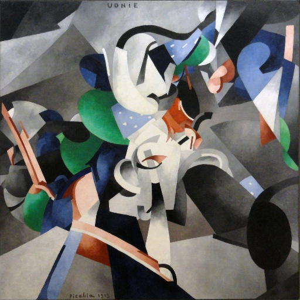
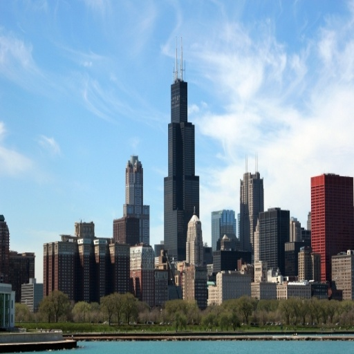
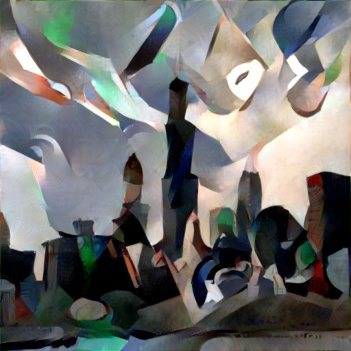
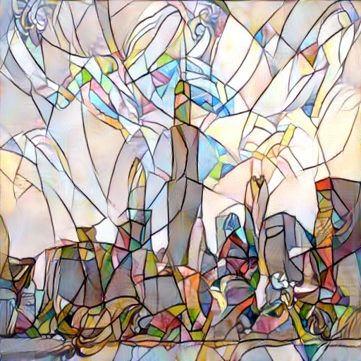

# Neural-Style-Transfer
PyTorch implementation of [A Neural Algorithm of Artistic Style](https://arxiv.org/abs/1508.06576) by Leon A. Gatys, et al.

<div align='center'>
  
  
  
</div>

<div align='center'>
  
  
  
</div>

### Progress
This is the progress of the first few iterations

<div align='center'>
   
   
</div>

### Implementation Details
- The hyperparameters are same as used in the paper.
- All the code was written and ran on Google Colab.
- As in the paper, conv1_1, conv2_1, conv3_1, conv4_1, conv5_1 are used for style loss.
- SImilarly, conv4_2 is used for content loss.
- PyTorch's forward hooks are used to extract intermediate feature maps.
- VGG19's MaxPool2d layers were replaced by AvgPool2d layers.

### Requirements
``` bash
torch
torchvision
numpy
matplotlib
Pillow
imageio
```

### References
1. **Leon A. Gatys, et al.** *A Neural Algorithm for Artistic Style* [[arxiv](https://arxiv.org/abs/1508.06576)]
